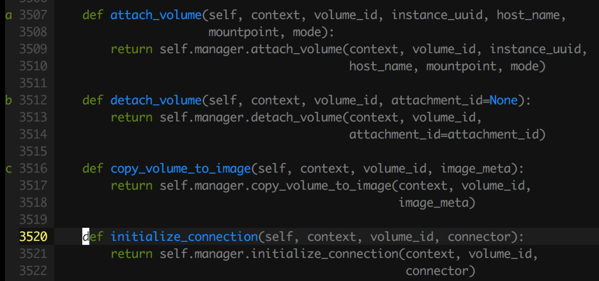
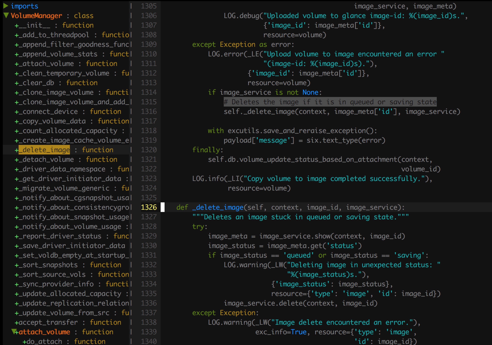
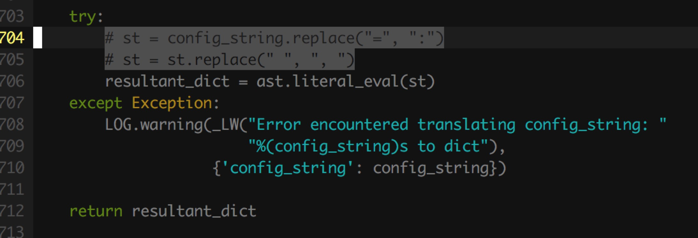
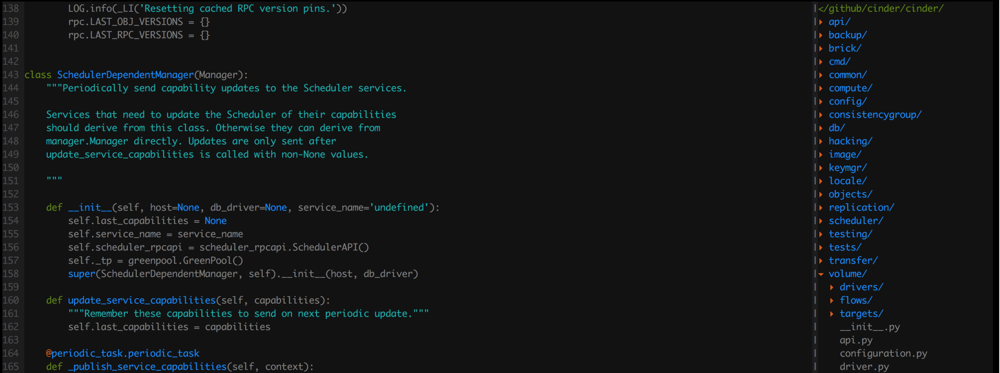
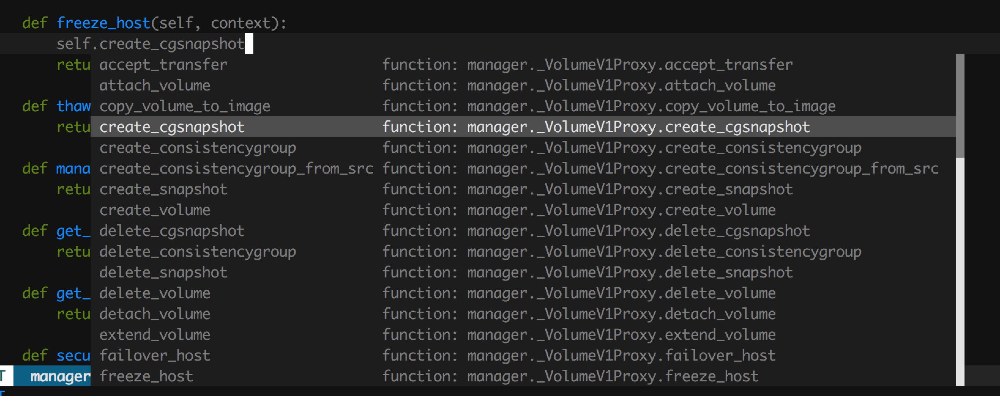
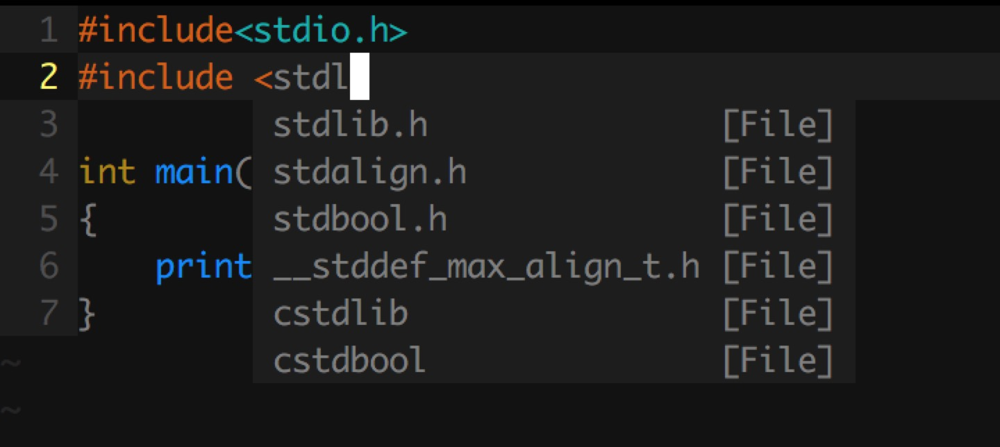
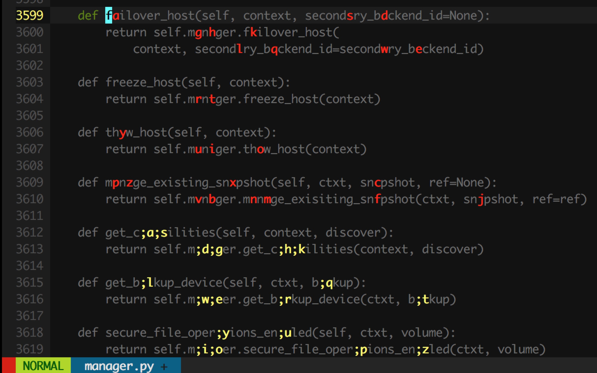

[English Version](README.en.md)

# dotfiles

vim、zsh、tmux等配置文件管理。

## 1 ssh

### 1.1 快速配置

在ssh目录下直接运行`setup.sh`脚本即可，不需要其它额外配置。

### 1.2 连接复用

通常我们ssh连接到一台服务器退出后连接即断开，再次连接时会重新建立连接，需要重新校验密钥或密码。如果使用密码登录，则需要反复输入密码，在需要管理大量远程服务器时效率极低。密码是静态不变使用sshpass可以避免每次输入密码，但显然这是极其不安全的。如果密码是动态生成的，比如跳板机，每次需要打开手机查看动态密码非常麻烦。

ssh连接复用是指一旦成功建立远程主机的ssh连接会保持一段时间的session，在session有效期内可以复用该连接，不需要重新做身份验证。这有点类似sudo命令，第一次输入密码后，再次执行sudo命令不需要输入密码了。

ssh连接复用配置如下:

```
ControlMaster auto
ControlPersist yes
ControlPath ~/.ssh/socks/%h-%p-%r
```

第一次建立连接时会在ControlPath目录下生成一个socket文件，文件格式为`%h-%p-%r`, 其中`%h`表示远程主机名，`%p`指连接的端口,`%r`是登录用户名。

**注意：**

* `.ssh`目录权限应设为`600`.
* `~/.ssh/socks`目录需要手动创建。

### 1.3 保持会话

ssh成功登录到一台服务器即创建了一个新的会话，当该会话超过一定时间内没有接收任何请求时，会话会自动断开连接。有时这不是我们所期望的，比如ssh到一台服务器后，google下资料回来发现ssh断开了。

为了保持会话，可以设置ssh客户端每隔一段时间自动发送一个心跳，比如每隔60s发送一个hello包。

```
ServerAliveInterval 60
```

我们还可以设置允许发送心跳的最大数量`ServerAliveCountMax`，当超过这个数量仍然没有接收用户响应时则会自动断开连接。

### 1.4 禁用主机key校验

ssh连接时会检查主机的公钥，如果第一次连接主机会显示该主机的公钥指纹，需要用户确实是否信任该主机。

```
The authenticity of host '192.168.56.4 (192.168.56.4444)' can't be established.
RSA key fingerprint is a3:ca:ad:95:a1:45:d2:57:3a:e9:e7:75:a8:4c:1f:9f.
Are you sure you want to continue connecting (yes/no)?
```

如果我们跑后台脚本时就会堵塞直到接收用户输入，导致后台脚本不能正常运行。

如果确认信任该主机并且保证不会被劫持攻击的话，可以跳过主机公钥校验，配置如下:

```
StrictHostKeyChecking no
UserKnownHostsFile /dev/null
```

如果通过shell连接，不建议禁用公钥校验。

## 2 tmux

### 2.1 快速配置

运行`tmux/setup.sh`脚本即可，不需要其它额外配置。

### 2.2 配置说明

`prefix`键为默认的`ctrl-b`，个人感觉`ctrl-b`挺方便的，很多人设置为`ctrl-a`，这会与在命令行下快速移动光标到行首冲突，需要按两下ctrl-a。

设置分屏:

```
# Split windows
bind \ split-window -h
bind - split-window -v
```

这样容易记住，`|`垂直分屏，`-`水平分屏。

禁用windows自动命名，主要是它会覆盖原来的名字:

```
set-option -g allow-rename off  # prevent system from renaming our window
```

设置windows从1开始索引：

```
set -g base-index 1 # window index from 1, not zero
```

重新加载配置文件（prefix+r)：

```
bind r source-file ~/.tmux.conf \; display "Reloaded!"
```

打开一个临时窗口查看man手册:

```
bind-key / command-prompt "split-window -h 'exec man %%'"
```

只需要输入`prefix+/`,然后输入需要查询的命令即可。

## 3 vim

### 3.1 Setup

在`dotfiles/vim`目录下运行`setup.sh`即可自动完成配置，配置过程中会自动安装vundle以及插件。

配置过程中可能出现Solarized方案不存在错误，由于该方案还没有安装，直接忽略该错误即可。

除了以上配置还需要系统完成以下包的安装:

* `ctags`
* `cmake`
* `g++`(CentOS下包名为`gcc-c++`)
* `python-devel`

检查ctags是否安装成功:

```
ctags --list-languages
```

最后配置YCM，在`~/.vim/bundle/YouCompleteMe`目录下运行`install.py`脚本。注意执行该脚本时必须已经安装`cmake`、`g++`、`python-devel`等，否则会build失败。

检查是否配置成功,大多数功能一般不会有什么问题，不需要检查，唯独自动补全功能需要确定是否工作，随便编辑一个C文件，看是否支持自动补全。

### 3.2 全局配置

全局配置指vim原生支持的功能配置，不需要安装任何插件。

#### 3.2.1 通用配置

```vim
" 开启文件类型侦测
filetype on
" 根据侦测到的不同类型加载对应的插件
filetype plugin on
" 自动缩进
filetype indent on

" 开启语法高亮功能
syntax enable
" 允许用指定语法高亮配色方案替换默认方案
syntax on

set nocompatible "禁用vi兼容模式
set incsearch "开启增量搜索
set ignorecase "搜索忽略大小写
set wildmenu "vim命令自动补全
set autoread "文件自动更新
set gcr=a:block-blinkon0 "禁止光标闪烁
set laststatus=2 "总是显示状态栏
set ruler "显示光标位置
set number "显示行号
set cursorline "高亮显示当前行
"set cursorcolumn "高亮显示当前列
set hlsearch "高亮显示搜索结果
set backspace=2 "回退键生效
```

#### 3.2.2 设置Leader键

Leader键是快捷键的前缀，类似于tmux的prefix键。根据个人习惯可以自定义Leader键，有人设置为`;`(分号)，也有人设置为空格键`"let mapleader="\<space>"`，空格键默认功能是向右移动光标，如果设置为Leader键，恢复原来的功能需要按两次空格键。为了方便，我设置Leader键为`'`（单引号):

```vim
let mapleader="'"
```
#### 3.2.3 设置制表符

设置制表符占用4个空格字符，并且自动扩展为4个空格:

```vim
set expandtab " 将制表符扩展为空格
set tabstop=4 " 制表符占用空格数
set shiftwidth=4 " 设置格式化时制表符占用空格数
set softtabstop=4 " 让 vim 把连续数量的空格视为一个制表符
```

#### 3.2.4 打开上次关闭文件的位置

打开一个文件时vim光标位置默认位于第一行，如果需要设置光标位于上次关闭时位置，配置如下:

```vim
if has("autocmd")
      au BufReadPost * if line("'\"") > 1 && line("'\"") <= line("$") | exe "normal! g'\"" | endif
endif
```
**注意：**如果不生效，可能是由于~/.viminfo没有访问权限，需要修改owner:

```bash
chown yourname ~/.viminfo
```

#### 3.2.5 快捷键配置

```vim
" 设置快捷键将选中文本块复制至系统剪贴板
vnoremap <Leader>y "+y

" 设置快捷键将系统剪贴板内容粘贴至 vim
nmap <Leader>p "+p

" 定义快捷键关闭当前分割窗口
nmap <Leader>q :q<CR>

" 定义快捷键保存当前窗口内容
nmap <Leader>w :w<CR>

" 定义快捷键保存所有窗口内容并退出 vim
"nmap <Leader>WQ :wa<CR>:q<CR>

" 不做任何保存，直接退出 vim
"nmap <Leader>Q :qa!<CR>

" 跳转至右方的窗口
nnoremap <Leader>l <C-W>l

" 跳转至左方的窗口
nnoremap <Leader>h <C-W>h

" 跳转至上方的子窗口
nnoremap <Leader>k <C-W>k

" 跳转至下方的子窗口
nnoremap <Leader>j <C-W>j

" 清除高亮显示
nmap <Leader>N :noh<CR>
" 定义快捷键在结对符之间跳转
nmap <Leader>M %

nnoremap <Leader>g <C-]>
nnoremap <Leader>b <C-t>
```

#### 3.2.6 gvim配置

图形化vim配置，通常不需要:

```vim
" 禁止显示滚动条
set guioptions-=l
set guioptions-=L
set guioptions-=r
set guioptions-=R

" 禁止显示菜单和工具条
set guioptions-=m
set guioptions-=T
```

### 3.3 插件列表

#### 1. Vundle

Vim bundle的简写，它是当前最流行的vim插件管理工具。虽然目前最新版vim已经内置支持插件管理了，不过鉴于目前使用的大多数还是7.3、7.4，因此本人仍使用vundle插件管理，以下所有的插件均是通过vundle管理的。

安装vundle:

```
git clone https://github.com/VundleVim/Vundle.vim.git ~/.vim/bundle/Vundle.vim
```

在vim配置文件`~/.vimrc`中启用vundle:

```vim
set rtp+=~/.vim/bundle/Vundle.vim
" vundle 管理的插件列表必须位于 vundle#begin() 和 vundle#end() 之间
call vundle#begin()
Plugin '1'
Plugin '2'
...
Plugin 'n'
" 插件列表结束
call vundle#end()
```

查看插件列表:

```vim
:PluginList
```

安装插件:

```
:PluginInstall
```

或者

```bash
vim "+PluginInstall" "+x" "+x"
```

更新插件:

```
:PluginUpdate
```

禁用插件直接在~/.vimrc注释插件即可，如果需要从本地彻底删除，运行以下命令:

```
:PluginClean
```

或者

```
vim "+PluginClean" "+x" "+x"
```

#### 2. vim-powerline

主要功能是使vim底部的状态栏更美观。

#### 3. vim-cpp-enhanced-highlight

c++语法高亮增强，支持c++11/14，增加标准库/boost类型和函数高亮。

#### 4. vim-signature & BOOKMARKS--Mark-and-Highlight-Full-Lines

书签可视化以及书签行高亮。在命令行下输入m然后任意字母创建标签,效果如图:



#### 5. tagbar

taglist的增强版本，需要安装ctags包，设置的快捷键为<Leader>键+t:
即按下`'`然后按`t`打开标签列表：



其它配置项如下:

```
let tagbar_left=1
nnoremap <Leader>t :TagbarToggle<CR>
let tagbar_width=32
"tagbar 子窗口中不显示冗余帮助信息
let g:tagbar_compact=1
```

#### 6. nerdcommenter

方便批量注释，能够自动识别语言，比如shell增加`#`，而C语言使用`/* ... */`等。

使用可视化v`(Shift+V)`选中文本后，使用<Leader> cc注释，使用<Leader> cu取消注释:



#### 7. nerdtree

项目文件浏览，使用<Leader> f打开:



#### 8. YouCompleteMe

Vim自动补全插件，能够集成ctags以及jedi等，效果如图:





#### 9. ctrlp

文件搜索功能，能够在vim上快速搜索文件并打开。在命令行模式下输入`ctrl+p`触发:


#### 10 vim-easymotion

快速在文本中跳转，f命令的增强版，按两下Leader键和f命令组合使用,比如跳转在有a字母的位置：

```
<Leader> <Leader> fa
```

此时再按高亮显示的字母即可以快速跳转到选择的位置。

效果如图:



#### 11. vim-surround'

处理各种括号以及html标签，比如`()[]()`

比如把`"Hello World！"`删除引号转化为`Hello World!`，输入`ds"`. 需要把双引号修改为单引号，输入`cs"'`。

参考[sdf13](http://vim.spf13.com/):

```
  Old text                  Command     New text ~
  "Hello world!"           ds"         Hello world!
  [123+456]/2              cs])        (123+456)/2
  "Look ma, I'm HTML!"     cs"<q>      <q>Look ma, I'm HTML!</q>
  if x>3 {                 ysW(        if ( x>3 ) {
  my $str = whee!;         vllllS'     my $str = 'whee!';
```
#### 12. 其它插件

```vim
* vim-scripts/grep.vim' "在命令行模式使用grep命令，:Grep
* vim-scripts/ShowTrailingWhitespace.git' "高亮显示行尾的多余空白字符
* vim-scripts/indentpython.vim.git'
* vim-scripts/Solarized.git' "主题方案
* nathanaelkane/vim-indent-guides.git' "缩进对齐显示
* davidhalter/jedi-vim' "python自动补全，不依赖于tags,但比较慢，可以使用indexer替换，但不能跳转项目外
* vim-scripts/Markdown' " Markdown语法高亮
* ekalinin/Dockerfile.vim' " Dockerfile语法高亮
* fatih/vim-go " go语言语法高亮
```

### 3.4 Theme

使用Solarized主题方案。

## 4 zsh

### 4.1 配置

直接运行`zsh/setup.sh`,该脚本会自动安装oh-my-zsh。

### 全局配置

待补充。

### 4.2 插件列表

#### git

提供git的大多数别名，并且在git项目下会自动显示所在的分支。

#### zsh-syntax-highlighting

语法高亮，命令错误或者命令返回错误会高亮显示。


上图中`sl`命令不存在，因此红色高亮显示，并且`➜`显示红色，表示上条命令返回了错误码。

#### extract

只需要输入`x+文件名`就能解压缩文件，不需要知道它是tar、gz还是xz。

#### z

类似autojump，输入`z`能够查看cd历史记录以及权重，输入`z 模糊路径`能够快速cd到匹配的目录中。

### 4.3 主题列表

使用默认的`robbyrussell`主题。

### 4.4 alias列表

待补充。

```bash
alias rm='rm -i'
alias mv='mv -i'
alias cp='cp -i'
alias grep='grep -E'
alias df='df -h'

# alias for harborclient
alias harbor='docker run \
 -e HARBOR_USERNAME="admin" \
 -e HARBOR_PASSWORD="Harbor12345" \
 -e HARBOR_URL="http://192.168.56.4" \
 --net host --rm krystism/harborclient'
# get my ip 
alias my_ip="docker run -t -i --rm alpine sh -c 'ip route get 8.8.8.8' | cut -d ' ' -f 8 | head -n 1"

# ipcalc not on Mac
ipcalc='docker run -t -i --rm alpine ipcalc'
 
```
## 5 pip

使用中科大源:

```bash
cat >>~/.pip/pip.conf <<EOF
[global]
index-url = https://pypi.mirrors.ustc.edu.cn/simple
EOF
```
## 6 git

**注：**使用tig命令替换git命令。

### 6.1 颜色方案

```
[color]
    ui = true
[color "branch"]
    current = yellow reverse
    local = yellow
    remote = green
[color "diff"]
    meta = yellow bold
    frag = magenta bold
    old = red
    new = green
```
### 6.2 alias列表

待补充。

## 7 非常棒的命令行工具

* [ag](https://github.com/ggreer/the_silver_searcher): 比grep、ack更快的递归搜索文件内容。
* [tig](https://github.com/jonas/tig): 字符模式下交互查看git项目。
 


* [mycli](https://github.com/dbcli/mycli): mysql客户端，支持语法高亮和命令补全，效果类似ipython，可以替代mysql命令。
* [jq](https://github.com/stedolan/jq): json文件处理以及显示，可以替换`python -m json.tool`。
* [shellcheck](https://github.com/koalaman/shellcheck): shell脚本静态检查工具，能够识别语法错误以及不规范的写法。
* [yapf](https://github.com/google/yapf): Google开发的python代码格式规范化工具，支持pep8以及Google代码风格。

## 参考

1. [vim-sdf13](http://vim.spf13.com/)。
2. [所需即所获：像 IDE 一样使用 vim](https://github.com/yangyangwithgnu/use_vim_as_ide)。
